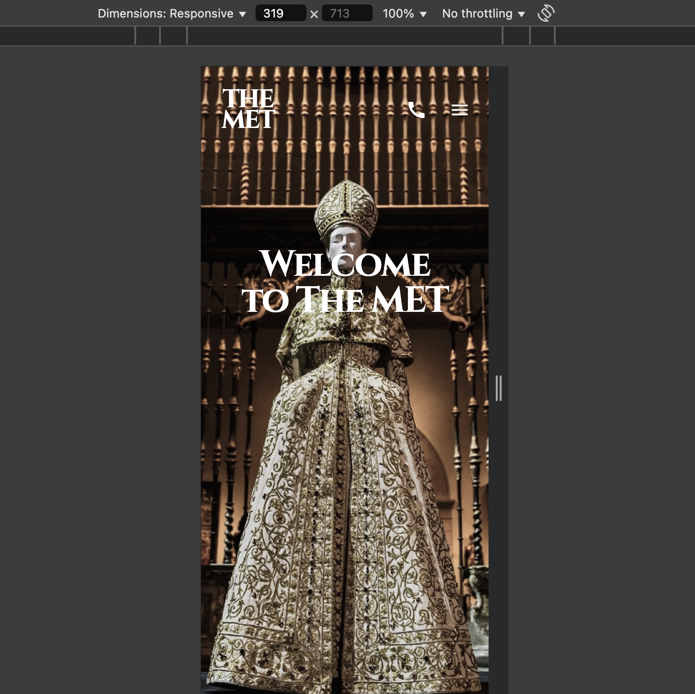
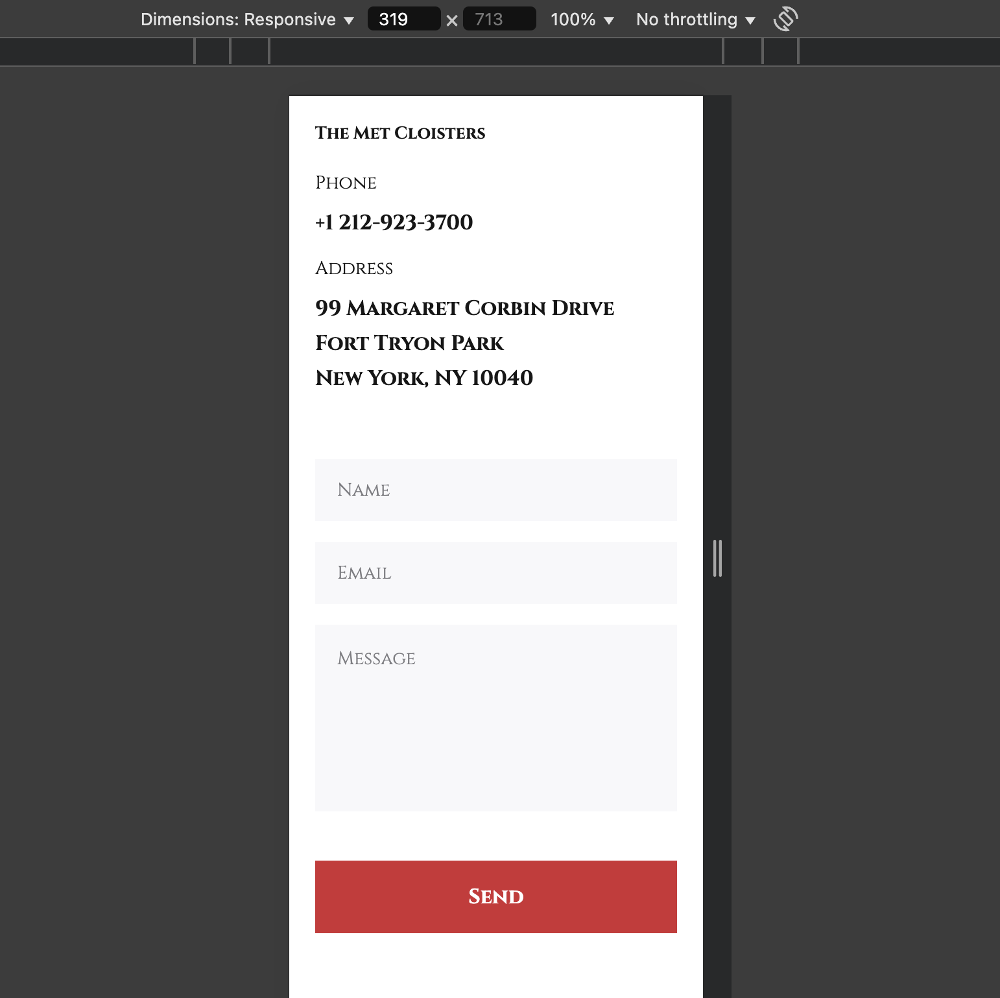
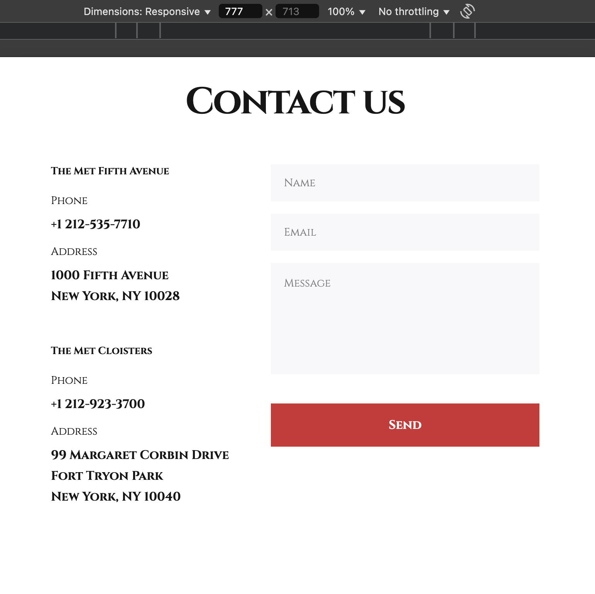
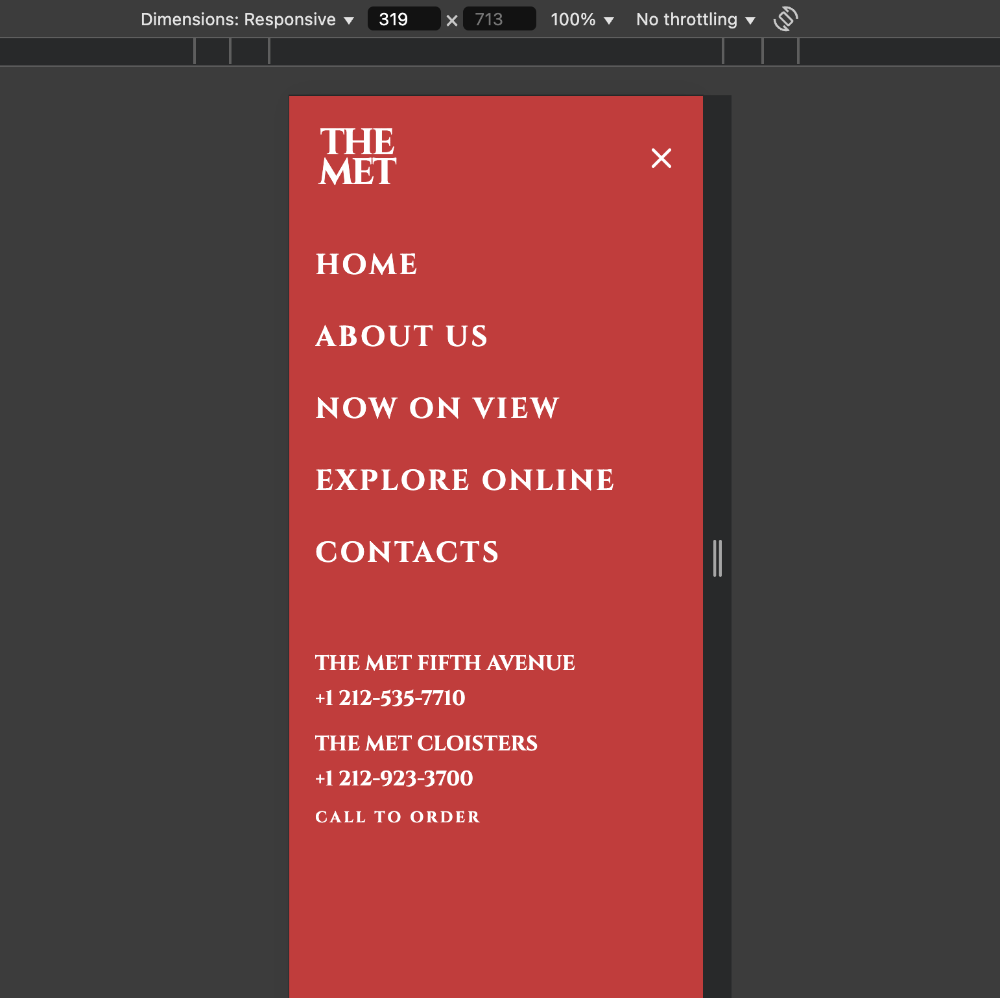
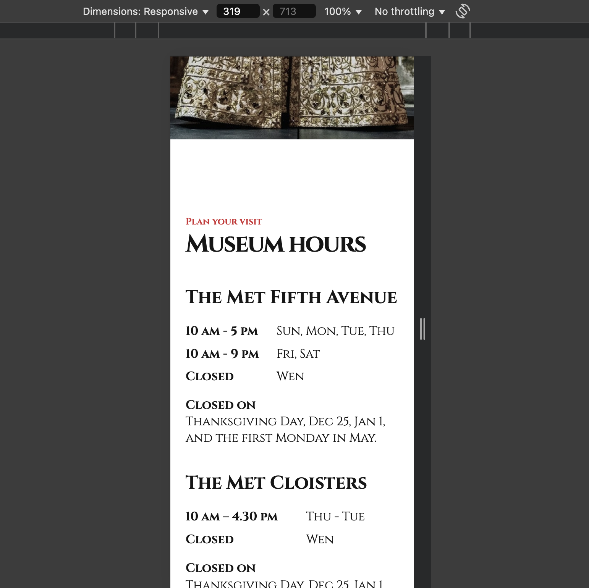

# MET Landing Page

A modern, responsive landing page for the MET brand, featuring a clean UI and interactive elements.

## 📸 Screenshots

<div align="center">
  
  <p><em>Main view of the Page</em></p>
  
  
  <p><em>Mobile design - Main Page</em></p>

  
  <p><em>Mobile design - Contacts Page</em></p>

  
  <p><em>Tablet design - Contacts Page</em></p>

  
  <p><em>Mobile design - Header</em></p>

  
  <p><em>Mobile design - Page</em></p>
</div>

## 🌟 Features

- **Responsive Design**

  - Adapts seamlessly to different screen sizes and devices
  - Modern aesthetics with contemporary design principles

- **Interactive Elements**

  - Engaging components to enhance user experience
  - Smooth animations and transitions

- **Modern UI/UX**
  - Clean and intuitive interface
  - Accessibility-first approach with ARIA labels

## 🛠️ Tech Stack

- HTML5
- CSS / SASS
- GitHub Pages

## 📦 Project Structure

```
/
├── index.html       # Main HTML file
├── styles/          # CSS stylesheets
├── images/          # Image assets
└── icons/           # Icon assets
```

## 🔍 Usage

1. **Viewing the Landing Page**

   - Open `index.html` in your preferred web browser

2. **Responsive Design**

   - The page automatically adjusts to different screen sizes

## 🎯 Live Demo

Check out the live version at: [MET Landing Page Demo](https://artem-brui.github.io/MET-Landing-page/)

## 🚀 Getting Started

### Prerequisites

- Modern web browser (e.g., Google Chrome, Mozilla Firefox, Safari)

### Installation

1. Clone the repository:

```bash
git clone https://github.com/Artem-Brui/MET-Landing-page.git
cd MET-Landing-page
```

2. Open `index.html` in your preferred web browser to view the landing page.

### Deployment

The application is deployed to GitHub Pages. To deploy manually, push changes to the `gh-pages` branch.
